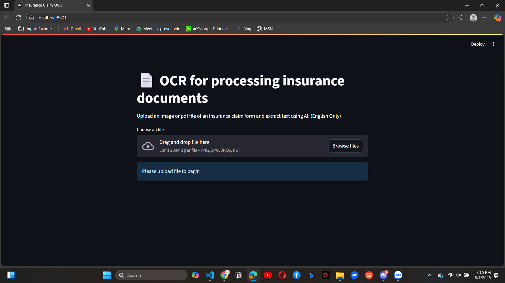
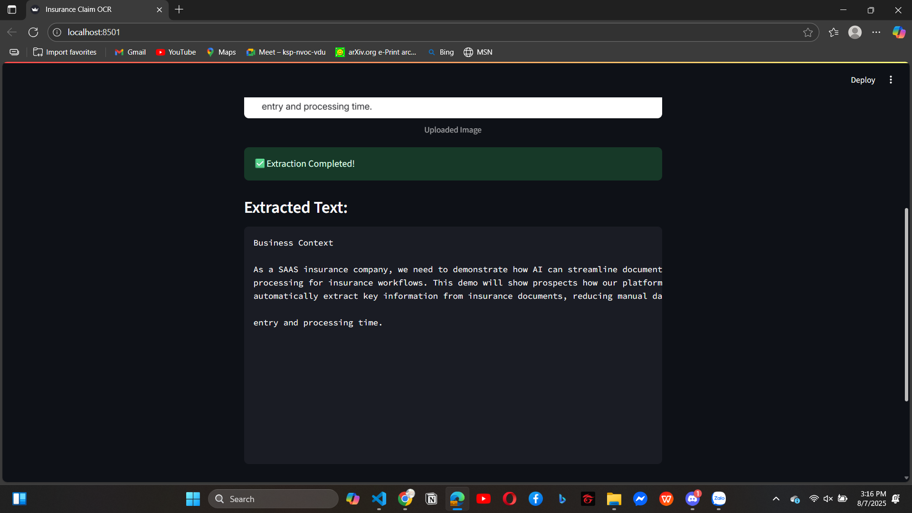

<h1>OCR INSURANCE PROCESSING</h1>

# About this assignment:
This is an assignment I got from the technical interview at CoverGo, I was required to build a website that they can upload file (image or pdf), then using AI tools to read and extract key information from the file

# What technologies I used?
Programming language: Python
Main libraries: streamlit, pdf2image, pytesseract

# What is the cons of this assignment?
- Although this project works, but I cannot extract all the key information.
- The UI is not too good, it is just enough to use.
- There is no organization in backend.
# How to run:
- 1: Clone/Pull this assignment to your localhost.
- 2: Go to the main directory (where have file app.py)
- 3: Run the command `streamlit run app.py`

# Demo images of my assignment:

